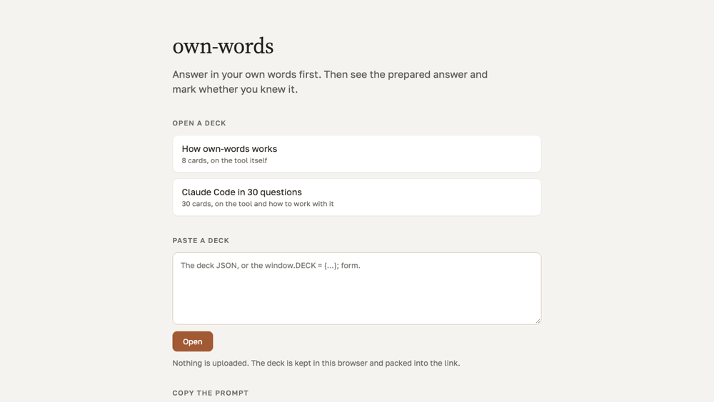

# own-words

own-words turns a topic into a deck of question cards. Each card asks a question, you type your
answer, and only then does the prepared answer appear; you mark it "I knew it" or "see again"
and go on.

I have ADHD. Reading a prepared answer first always felt like understanding, and then the next
real question found out that it was not. Typing my own answer first is what stuck, so the deck
now makes me do it before it shows me anything.



## Try it, nothing to install

https://alexslkgit.github.io/own-words/

Two decks are on that page: "How own-words works", 8 cards, and "Claude Code in 30 questions",
30 cards. Open one, answer three or four cards, and you have seen the whole thing.

## Make your own deck

No account for any of these.

Paste deck JSON into the box on the landing page. A fenced reply or a line of chat around the
JSON is fine; the box finds the deck inside it.

Press "Copy the prompt" on the same page, hand the prompt to any assistant along with your
topic, and paste back what it replies with.

Install the Claude Code plugin:

```
claude plugin marketplace add alexslkgit/own-words
claude plugin install own-words@own-words
```

Then run `/own-words` with a topic or a file. It writes `<topic-slug>.deck.json` in the current
directory, checks it, and prints the link that opens it.

A deck is one JSON file: a key, a title, and blocks of cards, each card a question and an
answer. The two decks above are in `decks/` in exactly that form, with nothing in them the
format does not give you. The file is also how a deck moves to another device: the link for the
30-card demo is about 17 KB because the whole deck travels inside it, so keep long decks as
files and share the link for short ones.

## Where the deck lives

The link carries the whole deck inside the URL, after `#d=`, compressed with lz-string. A URL
fragment is never sent in the HTTP request, so a deck link opens without any server ever
holding the deck. `deck.html` renders whatever deck it is handed and knows nothing else.

Every deck you open is kept in this browser's localStorage, under `ownwords:decks:<key>` and
`ownwords:index`, together with your answers and marks; the landing lists them under "My
decks". There is no account and nothing you write is stored on a server. Clearing site data
for the page drops the decks and the progress, and "My decks" empties; the `.deck.json` file or
the link brings a deck back, the progress does not come back.

The one time your text moves is the copy button on a card page. It builds a plain text form of
the deck: every card you touched, with the question, your own wording, and your mark, then the
numbers of the cards you left alone. Nothing is copied until you press it. Pasting that form
back into the chat that wrote the deck is how you ask for harder cards.

Plain HTML and JavaScript, no build step, one vendored dependency (lz-string). The pages ask
Google Fonts for two typefaces; block that and everything still works in a system font,
including from a `file://` path.

connector/ is a small remote MCP server you can deploy to your own Cloudflare account so
claude.ai can hand you a deck link directly; see connector/README.md.

## Uninstall

```
claude plugin uninstall own-words@own-words
claude plugin marketplace remove own-words
```

The site needs nothing installed, so closing the tab is enough.

## Requirements

A modern browser, for the site and for any deck link. The plugin needs Claude Code.

This is one person's tool at version 0.1.0. I use it daily on my own decks; the English strings
in it are new, so if a line reads oddly, that is why.

If you tried it on something you actually needed to learn, did writing your own answer first
change what you remembered a week later? Open an issue and tell me:
https://github.com/alexslkgit/own-words/issues

MIT, see LICENSE.
